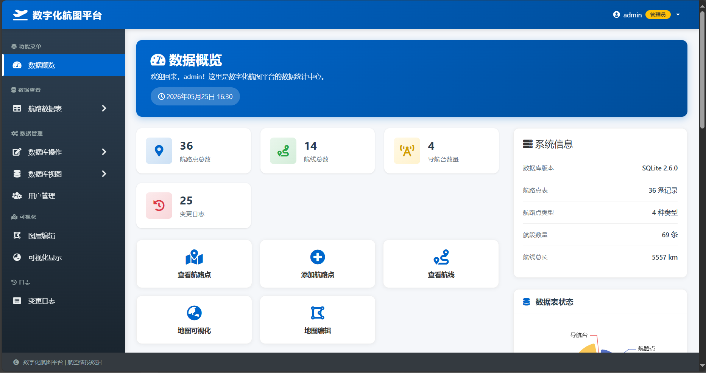
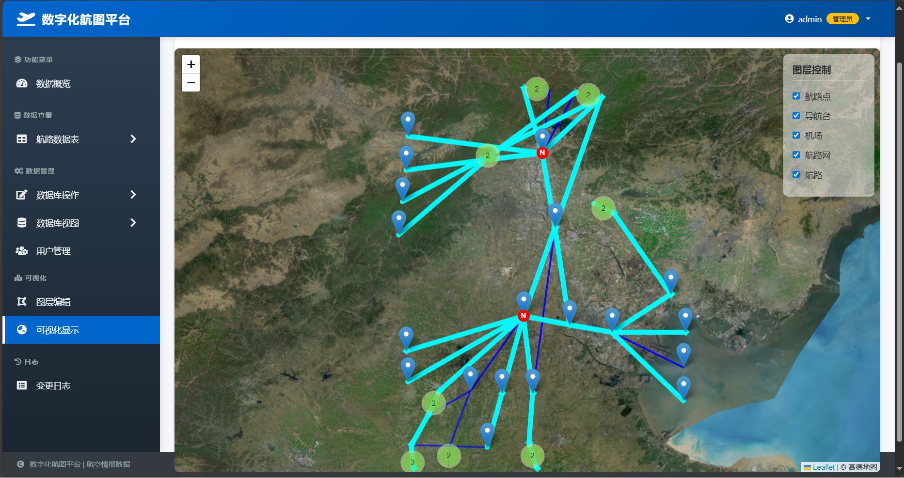

# 航空情报数据模型及数据库技术

* Information Database(INFODB)

2025年9月 -- 2026年1月

(大三上) 课程航空情报数据模型及数据库技术学习

📚 [项目详细描述](docs/project_description.md) | [数据库范式](docs/db_normalization.md)

## 主要界面展示

- 启动程序
```bash
    python main.py
```
程序端口：http://localhost:5000

### 登录


### 主操作界面

同时用于数据库内容的统计和可视化展示



### 地图可视化展示航路和航路点



## 技术支持

- [Python 3.12](https://www.python.org/downloads/release/python-3120/)

- [SQlite](https://sqlite.org/index.html)

- [Leaflet.js](https://leafletjs.com/)

- [MAP](https://www.amap.com/)

## 许可证

本项目采用 [MIT 许可证](LICENSE) 开源。
